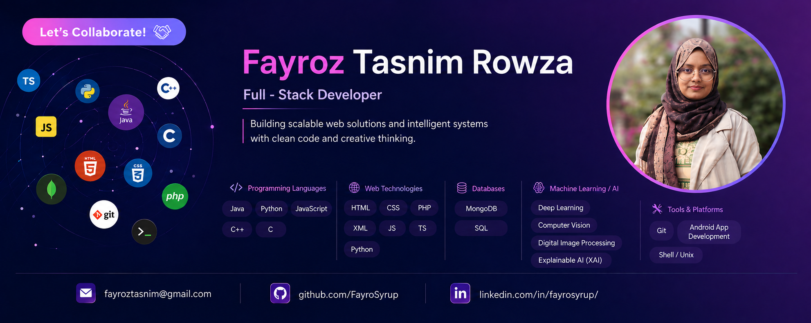

<!-- Banner -->

<h1 align="center">Fayroz Tasnim Rowza</h1>

  

  
  
  
  

---

## About Me
CSE student at East West University, Dhaka, and Full-Stack Developer building toward a career in AI Engineering. I work across machine learning, deep learning, computer vision, and full-stack development, combining software engineering with intelligent systems to solve real-world problems. I believe great technology should be more than technically functional; it should be useful, purposeful, and impactful.

- 🎓 B.Sc. in CSE, East West University
- 📍 Dhaka, Bangladesh
- 🧠 Focused on the intersection of AI and real-world software

---

## What I'm Working On

- 🤖 Exploring **Agentic AI and AI Engineering** — building intelligent, tool-using systems and understanding how AI models reason and make decisions
- 🖼️ Deepening expertise in **Computer Vision** and **Digital Image Processing**
- 🌐 Developing **full-stack applications** and integrating AI/ML pipelines into practical software systems
- 📱 Expanding into **Android App Development**
- 📝 Conducting research on **nutrition-focused machine learning systems** through my capstone project, **NutriNexus**

---

## Skills

### Languages

  
  
  
  
  
  

### Web Technologies

  
  
  
  

### Databases

  
  

### AI / Machine Learning

  
  
  
  
  
  

### Tools & Platforms

  
  
  
  
  

---

## GitHub Stats

  
  

  

---

  

